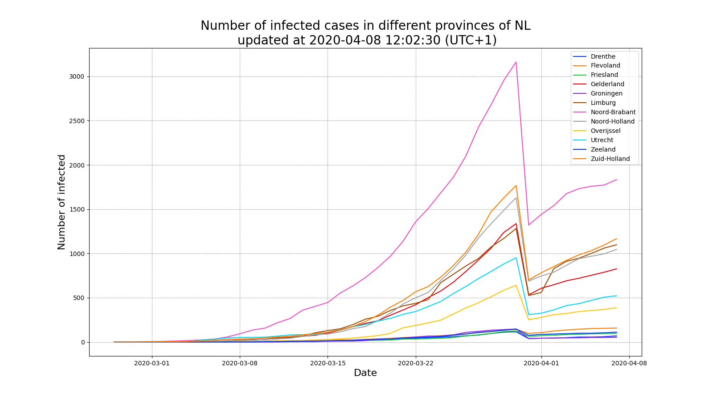
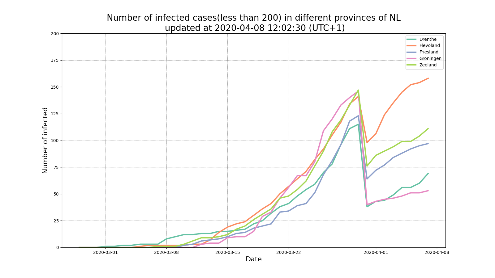
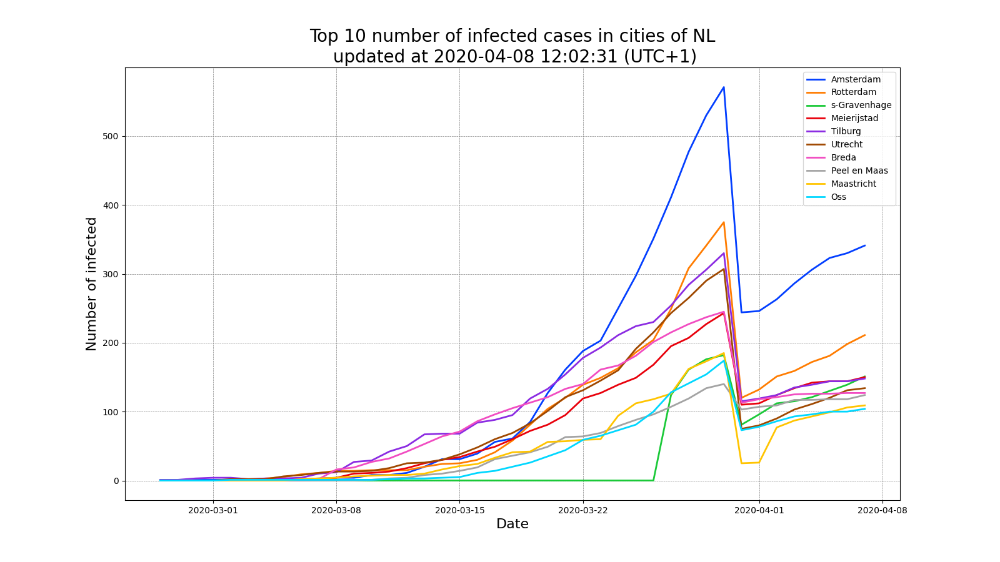

# COVID-19-NL

Collect and update the information of positively tested cases for the Coronavirus in the Netherlands.

The data is updated automatically and stored in _data_ folder.

## Data sources

[Coronavirus (COVID-19) messages](https://www.volksgezondheidenzorg.info/onderwerp/infectieziekten/regionaal-internationaal/coronavirus-covid-19#node-coronavirus-covid-19-meldingen) provided by RIVM

**(Does not work anymore)**  
The direct link to download the csv:
`https://www.volksgezondheidenzorg.info/sites/default/files/map/detail_data/klik_corona{day}{month}{year}_rec_0.csv`

## Visualizations

## Docker supported

Also, I add a _Dockerfile_ here, if you want to run the codes within a Docker container.
The detail of the container can be find [here](https://github.com/ZequnZ/py-docker) , which is another repo of mine :)
Just follow:

1. Build a Docker container with the _Dockerfile_: `docker build -t zequnz/py-docker:0.0.5 .`
2. Run the container and get the containerID, here you have different options:
   - Just want to run the script: `docker run -itd -v $(pwd)/data:/app/data zequnz/py-docker:0.0.5 python src/workflow.nl`
   - Also run the jupyter notebook to play with the codes: `docker run -itd -p 8990:8990 -v $(pwd):/app zequnz/py-docker:0.0.5`
3. (Optional) To start the notebook, you need to go into the container: `docker exec -it <containerID> bash`
4. (Optional) Start the notebook: `jupyter notebook --ip 0.0.0.0 --port 8990 --no-browser --allow-root`

## TODO

- [x] Process the data with [the information of the Dutch municipalities](https://www.cbs.nl/-/media/_excel/2020/03/gemeenten%20alfabetisch%202020.xlsx)
- [x] Save the data in the _data_ folder
- [x] Create a Github workflow to update the data automatically
- [x] Data aggregation
  - [x] City-based data
  - [x] Province-based data
- [x] Provide some visualizations
  - [x] Lineplot showing the number of infected in different provinces
  - [x] Lineplot showing the top 10 number of infected in different cities

## Author

- ZequnZ

## License

This project is licensed under the MIT License - see the LICENSE.md file for details

## Acknowledgement

Thanks [covid19-eu-data](https://github.com/covid19-eu-zh/covid19-eu-data) for inspiring me.

Thanks Koelink for providing great data source in your [repo](https://github.com/Koelink/COVID-19-NLDATA)
